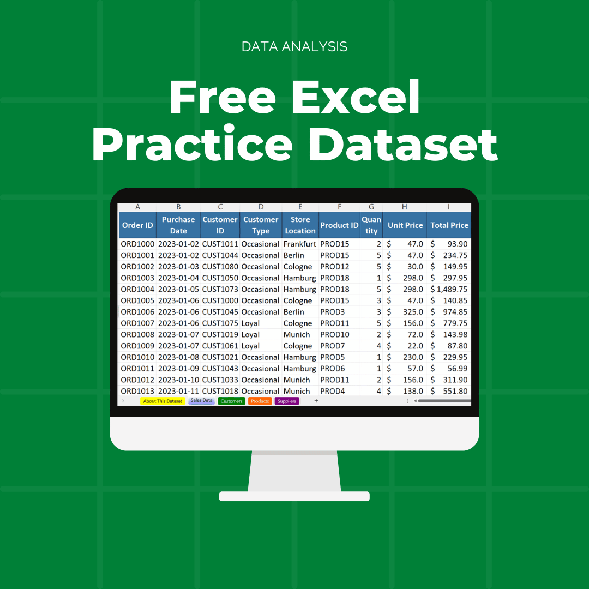

# Free Excel Practice Dataset for Data Analysis

## Overview
Get hands-on with a realistic dataset to practice data analysis! This dataset is designed with sales trends, seasonal patterns, and customer behavior data, ideal for exploring in **Excel**, **PowerBI**, or **Python/Pandas**. It’s a great way to build your skills or even create a dashboard for your portfolio!

Included:
- **Excel dataset** with real-world data to practice your analysis skills.
- **Python script** to modify or expand the data, so you can customize it for your projects.

## Quick Download
[**Download the Dataset as a ZIP**](../../archive/main.zip)

---

### How to Use
1. **Excel**: Practice pivot tables, data validation, and create visualizations.
2. **PowerBI**: Build interactive dashboards and explore advanced visualizations.
3. **Python/Pandas**: Analyze and manipulate the dataset programmatically.

Let me know if you have questions or share your results—happy analyzing!

## 💡 Explore My Solutions
From Excel add-ins to messaging tools and logistics solutions.

👉 **[See All Solutions](https://pythonandvba.com/solutions)**## 🤝 Connect with Me
- 📺 **YouTube:** [CodingIsFun](https://youtube.com/c/CodingIsFun)
- 🌐 **Website:** [PythonAndVBA](https://pythonandvba.com)
- 💬 **Discord:** [Join our Community](https://pythonandvba.com/discord)
- 💼 **LinkedIn:** [Connect with me](https://www.linkedin.com/in/sven-bosau/)
- 📸 **Instagram:** [Follow me](https://www.instagram.com/codingisfun_official/)

## Support My Work
Love my content and want to show appreciation? Why not [buy me a coffee](https://pythonandvba.com/coffee-donation) to fuel my creative engine? Your support means the world to me! 😊

